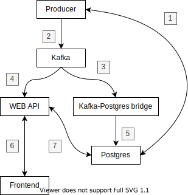

# Fullstack data flow model

## Purpose
There are 100 values, each is called `ticker_00, ticker_02, ..., ticker_99`. Each value is zero at the start, but every second, each values randomly goes one up or down.

The idea here is that we have a back-end, that generates random changes to number of values, and a front-end, allows to monitor that changes in real time. I used Docker Compose to run all the nesessary services.

To start app, simply run `docker-compose -f "docker-compose.yaml" up -d --build` and open `localhost:5000` in your browser.

## Data flow on back-end


Firstly, we have a `Producer` service. Upon start, it requests already exesting data from `Postgres` database (1). If no data exist, `Producer` initializes 100 tickers with zeroes. Than it starts generating random changes of each ticker value. Changes are pushed into `Kafka` (2).

There are two services, that are subcribed to `Kafka`. `Kafka-Postgres bridge` fetches new values from `Kafka` (3) and pushes them into `Postgres` database (5). It is the only way to add new data to database.

`WEB API` is a FastAPI based service. When `Frontend` connects to it, it fetches older data from `Postgres` database (7) and sends it to `Frontend` (6). It also fetches data from `Kafka` (4) in real time and sendes each new peice to `Frontend` with WebSocket.

## Kafka
Typical message, sent through `Kafka` or to `Frontend` contains information about name of the ticker, it's value, and timestamp of the exact moment, when this ticker had this value.

`{"name": name, "value": values[name], "time": timestamp}`

It is sent in form of json string.

Kafka has only one topic - `tickers` - that accepts given messages. I considered creating individual topic for each record. But I decided against it, becouse it would make this system less flexiable.

### DB
Postgres database has only one table:
```
CREATE TABLE records (
    id SERIAL PRIMARY KEY,
    name VARCHAR(10) NOT NULL,
    time TIMESTAMP NOT NULL,
    value INT NOT NULL
);
```
It is necessary to store all the information about changes of ticker values in the past. I also considered creating a table for each ticker, but that would be obviously an overkill.

## Containers

Docker compose maintains 10 containers total.

* producer - service, that generates values. Our source of data.
* zookeeper, kafka, init-kafka, kafdrop - those three containers are needed to keep Kafka alive. `init-kafka` creates topic on system start and than finishes to never wake up ever again. Or at least till next restart. `kafdrop` is a GUI tool to monitor `kafka` state. Go to `localhost:19000` to see for yourself.
* postgres, pgadmin - containers to work with database. Former contains postgresql database, while latter - is a GUI tool to work with given database. Check it out on `localhost:5050`. Password and user are set in `config.yaml` as PGADMIN_DEFAULT_PASSWORD and PGADMIN_DEFAULT_EMAIL respectively.
* kafka_postgres_bridge - service, that takes data from `Kafka` and posts it in `Postgres`. No more, no less.
* api_server - a bridge between frontend and back-end. It is a FastAPI based webserver.
* frontend - service contains Flutter-based frontend app and serves it to `localhos:5000`.

## Front-end
`Frontend` is a flutter web app, that allows to monitor changes of ticker values in realtime. It connects to `WEB API` with http and gets list of all ticker names. `WEB API` gets list from `Postgres` database. Than `Frontend` chooses first name and requests server old values of that ticker. Again, `WEB API` gets it from `Postgres`. Finaly, `Frontend` establishes connection via websocket with `WEB API`, which starts listening `Kafka`. `WEB API` sends to `Frontend` all messages from `Kafka` related to choosen ticker.


## Backlog

* kafka +
* kafka ui +
* python events source + 
* postgresql consumer logs events +
* pgadmin +
* source fetch events from bd on start +
* fastapi consumer fetch events from postgres +
* fastapi consumer brodcasts em through open websockets +
* flutter recieve values through websocket +
* fastapi consumer recieves events +
* flutter get older values on from fastapi +
* flutter storage +
* flutter ticker chooser +
* flutter graph + 
* flutter graph online +
* async sqlalchemy
* BUG frontend gets more events than needed +
* BUG sign invertion +
* BUG null on switching tickers +
* BUG bridge doesnt start on first try (key error value) -
* BUG bridge fails on restarting producer +
* get tickers list + 
* ask for specific ticker +
* flutter choose time -
* sliding window +
* prometheus
* graphana
* adding and removeing tickers on the fly ?
* configs in env
* use common module
* copy code in Dockerfile
* documentation
* logging